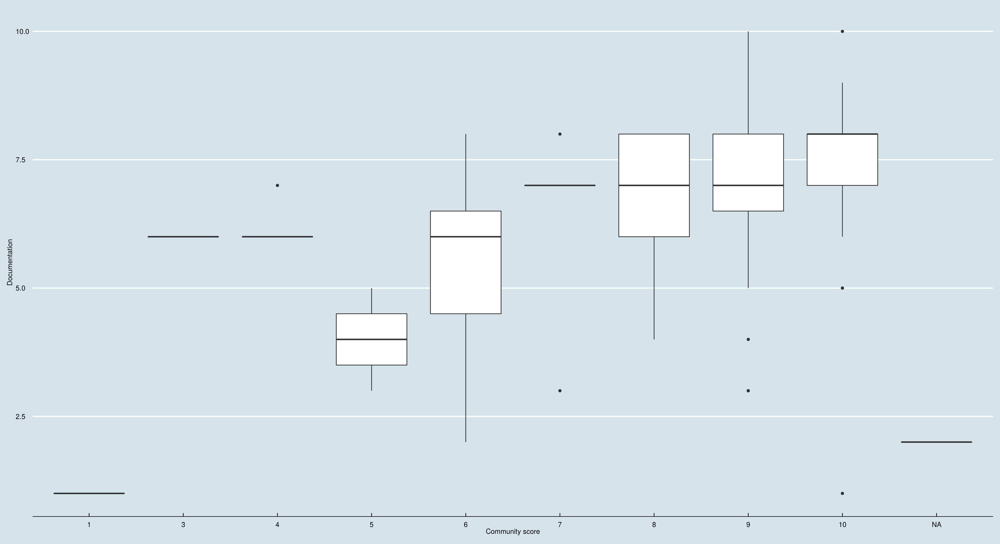
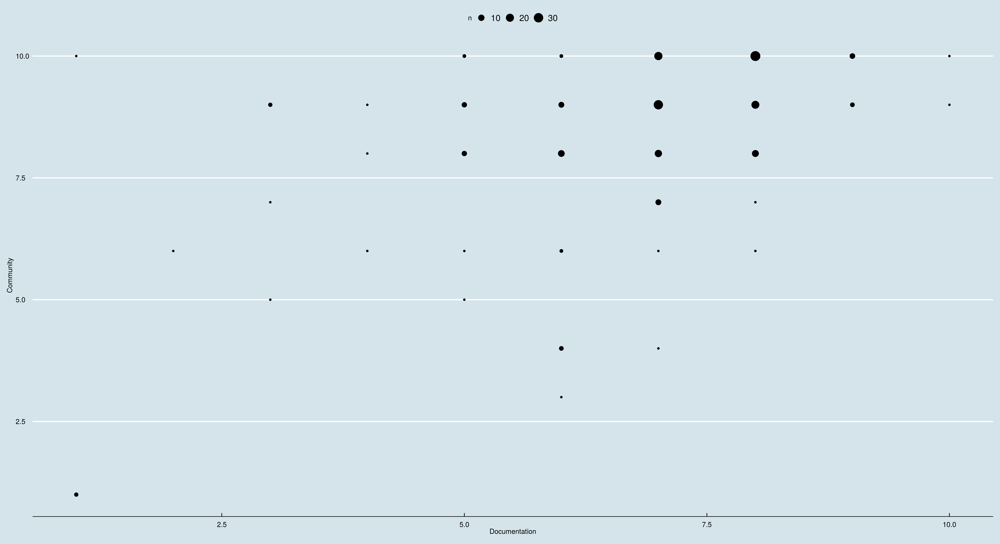

# Perl 6 Survey Results

* Latest Survey (June 2019): [Google Form results](https://docs.google.com/spreadsheets/d/1q9iZ_PTDvlJzjUm5ZZw1d2t0jOdWwYJL96fFjn0ooEY/edit?usp=sharing)
* [June 2018 results](https://docs.google.com/forms/d/e/1FAIpQLSdqrrcxTQWuN1ISAvz3j_XkpCCc2AuQw9uKgAhTivxHBFsweg/viewanalytics)
  
## Some charts

* [Age group vs previous use of Perl](html/sankey-agegroup-vs-perluse.html)
  
* [Use of Perl 6 vs. documentation score](html/sankey-perl6use-vs-docscore.html)

* [Use of Perl 6 vs. issues with installation](html/sankey-perl6use-vs-issues.html).
  
## Some boxplots

Documentation score vs. community score, in two different
visualizations.

